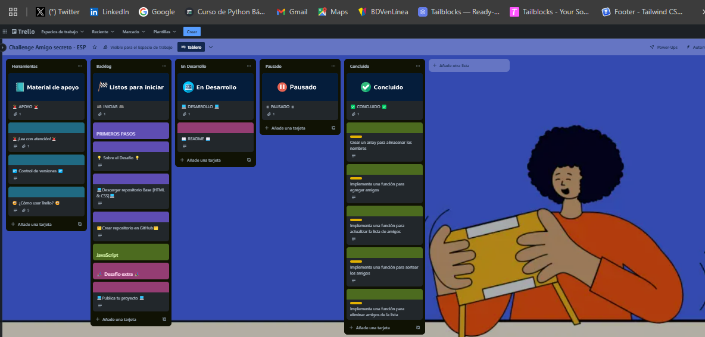
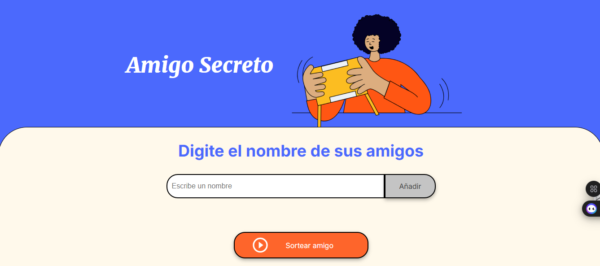
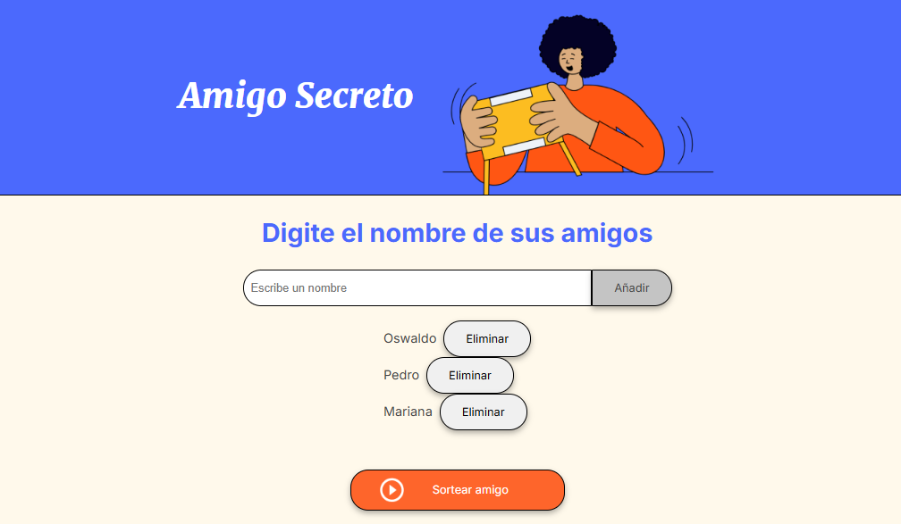
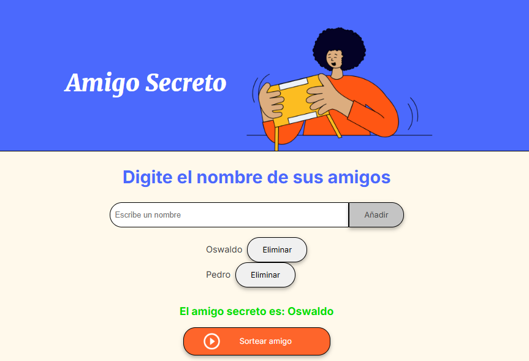
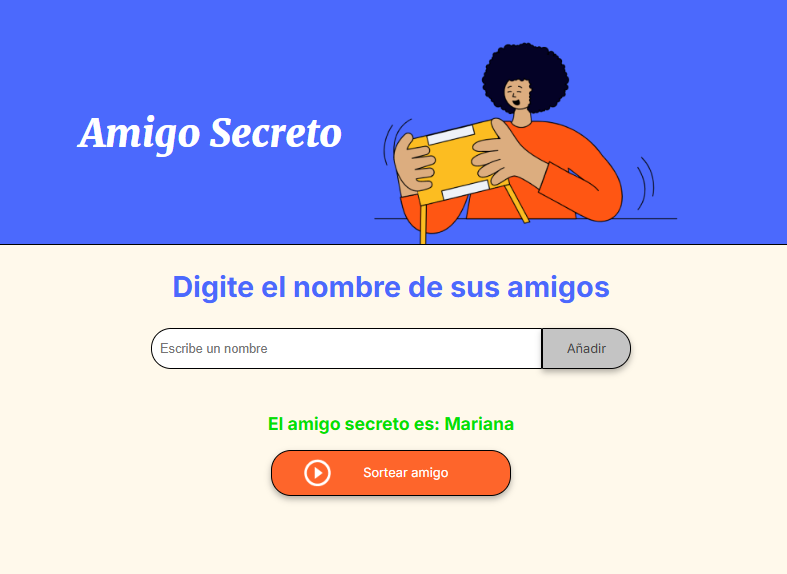

# Desafio Alura Amigo Secreto (Grupo 8)

Con este desafío colocarás en práctica conceptos fundamentales de lógica de programación como variables, condicionales, funciones, listas y lazos de repetición; estos conceptos constituyen la base de cualquier lenguaje de programación, independientemente de su complejidad.

Aplicación práctica del conocimiento:

Para aprender a manipular datos de forma eficiente es necesario conocer el concepto de variables, esto facilita la creación de programas que trabajan con información de forma dinámica. Condicionales, como el uso de if y else, son de vital importancia para controlar el flujo de programas.

Las funciones ayudan a modularizar el código, tornándolo mas organizado y reutilizable. También permiten ejecutar tareas específicas siempre que sea necesario, reduciendo las posibilidades de errores.

Saber trabajar con listas (arrays) es sumamente importante. Los arrays permiten adicionar o remover elementos, creando aplicaciones que procesan grandes cantidades de datos. Complementando eso, los lazos de repetición (loops), como o for, facilitan la ejecución repetida de acciones sobre una lista de elementos, tornando el proceso mas eficiente y menos susceptible a fallas.

Dominar estos conceptos es esencial para desarrollar soluciones computacionales, ya que forman la base común de todos los lenguajes de programación. Comprenderlos permite adaptarse a cualquier tecnología o plataforma con mayor facilidad.

1.- Se realizó clonación del repositorio del proyecto del usuario de Alura Latam.

2.- Se crearon las funcionalidades solicitadas en el proyecto incluso se incluyó el apartado de eliminar nombres de la lista.

3.- Se cumplió interactuar con JavaScript.

4.- Mostrar el resultado esperado según la lista agregada.
 

El sitio web se encuentra alojado en Github de manera pública, se puede 
acceder al repositorio en el siguiente link : https://github.com/izquierdowaws/Amigo-Secreto

El sitio web se encuentra publicado en Github Page y se puede observar a través
del siguiente enlace: https://izquierdowaws.github.io/Amigo-Secreto/

### Autor:
- William Izquierdo